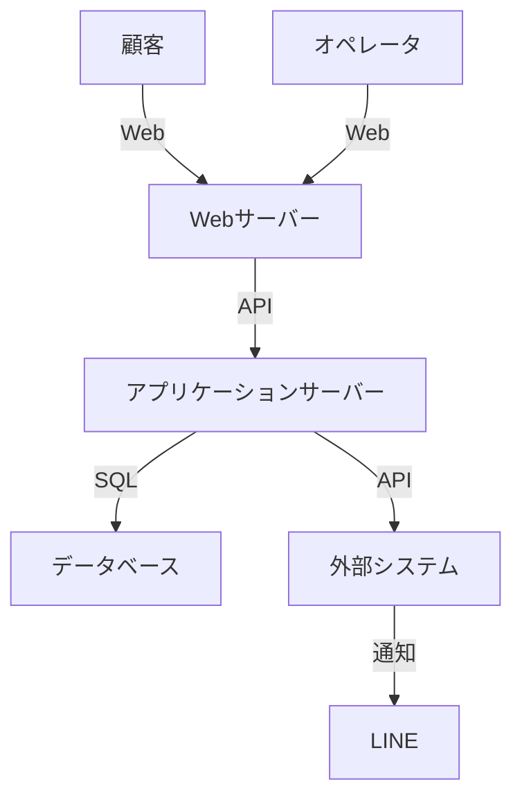

# 1. システム概要

## 1.1 システム名
3TAPシステム - 酒のステップ 受発注管理システム

## 1.2 目的
- 商品の受発注管理を効率化
- 顧客とオペレータ間のコミュニケーションを円滑化
- システム全体の運用状況の可視化

## 1.3 システム構成図

## 1.4 想定ユーザー
1. 顧客
   - 酒販店
   - 飲食店
2. オペレータ
   - 受注担当者
   - 商品管理者
3. システム管理者 